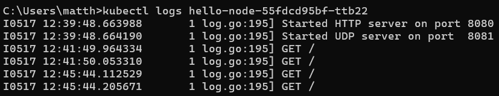

# Tutorial 11

1. Compare the application logs before and after you exposed it as a Service.
Try to open the app several times while the proxy into the Service is running.
What do you see in the logs? Does the number of logs increase each time you open the app?

- Before exposing the service, the log only shows which port the server is on. After the exposal of the service, it began logging the requests. Those requests can be seen in the logs as shown in the picture above.

2. Notice that there are two versions of `kubectl get` invocation during this tutorial section. he first does not have any option, while the latter has `-n` option with value set to
 `kube-system`.
 What is the purpose of the `-n` option and why did the output not list the pods/services that you
 explicitly created

- The -n stands for namespace. -n kube-system means instruct the terminal to search for the service with the namespace -n -kube-system.

# Rolling Update & Kubernetes Manifest File

1. What is the difference between Rolling Update and Recreate deployment strategy

Rolling Update gradually replaces old instances with new ones to maintain continuous availability, while Recreate involves stopping all old instances and simultaneously replacing them with new ones, resulting in a brief downtime but offering simplicity and predictability. The choice between the two depends on factors such as availability requirements and tolerance for downtime.

2. Try deploying the Spring Petclinic REST using Recreate deployment strategy and document
 your attempt.

3. What do you think are the benefits of using Kubernetes manifest files? Recall your experience
 in deploying the app manually and compare it to your experience when deploying the same app
 by applying the manifest files (i.e., invoking `kubectl apply-f` command) to the cluster

Using Kubernetes manifest files offers several benefits compared to manual deployment methods. First, manifest files provide a declarative approach to defining the desired state of Kubernetes resources, such as deployments, services, and pods, making it easier to manage and maintain complex application configurations. By encapsulating configuration details in manifest files, deployments become more reproducible and consistent across different environments. Additionally, manifest files can be version controlled, allowing for easy tracking of changes and enabling collaboration among team members. In my experience, deploying an app manually often involved repetitive tasks and potential human errors, whereas deploying the same app using manifest files streamlined the process, reduced errors, and provided a clear and auditable deployment history through version control systems like Git. Overall, leveraging Kubernetes manifest files significantly improves the efficiency, reliability, and maintainability of deploying applications in Kubernetes clusters.

